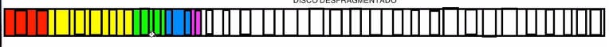

<!--Portada-->
<div align="center">

# Sistemas Operativos

### Actividad<br>Administración de memoria

### ISC

### Docente: Jesus Eduardo Alacaraz Chavez

### Alumno: Efren Mendez Villanueva

</div>

___
<!--3.1 Política y filosofía-->
<div align="center">

## 3.1 Politica y Filsoifa
</div>

### Fragmentación interna: ### 
Como su palabra lo indica **interna** nos da a entender que la particiones ocurren en la memoria, ahora estas particiones estan divididas en bloques con tamaños especificos 

por ejemplo:

podemos observar una Fragmentación interna la cual esta divida en partes iguales donde cada parte sera encargada de manejar los procesos


Al memento de asignarle estos procesos estos eran acomodados en los bloques que tenemos


Como se puede observar estos al ser colocados generan un desperdicio puesto que no estan aprovechando el 100% de cada uno.

***conclución:***<br>
La fragmentación interna puede llegar a generar desperdicios de memoria si un proceso no usa lo suficiente asignado puesto que este sobrando no se vuelve usar simplemente queda en nada

### Framgentación externa ### 
La gragmentación externa como su contraparte tambien puede llegar desperdicios pero por otra razones, puesto que esta es guardada de forma dispersa entonces tenemos desperdicios en espaciso que no estamos usando

por ejemplos:

aqui podemos obersvar una imagen de un disco HDD


Al llegarse queda algo asi


Podemos observar que los procesos estan gurdados de forma aleatoria lo cual genera espacios entre ellos

visto de otra forma lo tenemos asi


Esto tiene una solición donde se le puede aplicar una desfragmentación lo cual lo dejara asi



Esto ayuda a optimizar las busquedas muchisimo, aunque los SSD no necesariamente ocupan esto pero los HDD si

## Resuen completo
|  Fragmentación Intera  | Fragmentación Externa  
|  ------- |:----:
|  Ocurre dentro de un bloque asignado| Ocurre fuera de bloques asignados
|  Desperdicio dentro de la memoria asignada| Desperdicio por espacios dispersos 
| Relacionada con Ram y memoria virtual| Ocurre en RAM,memoria virutal, HDD o SDD
| No se puede desfragmentar | Se puede desfragmentar|

# 3.2 Memoria real

### Programa en C de particiones fijas
```C
#include <stdio.h>
#include <stdlib.h> //Para manejar la memoria

#define cantidadParticiones 5 //Numero de particiones maximas

//Estructura
typedef struct{
    int tamaño;    //Para el tamaño de nuestros procesos
    int ocupado;   // 0 no estara ocupado 1 estara ocupado
    int id;        // Para el id del proceso
}Particion;

// Función para inicializar las particiones
void inicializar(Particion particiones[]) {
    for (int i = 0; i < cantidadParticiones; i++) {
        printf("Ingrese el tamaño de la partición %d: ", i + 1);
        scanf("%d", &particiones[i].tamaño);
        particiones[i].ocupado = 0;
        particiones[i].id = -1;
    }
}

// Función para mostrar el estado actual de las particiones
void mostrar(Particion particiones[]) {
    printf("\nEstado actual de las particiones:\n");
    for (int i = 0; i < cantidadParticiones; i++) {
        printf("Partición %d: Tamaño %d, ", i + 1, particiones[i].tamaño);
        if (particiones[i].ocupado == 1) {
            printf("Ocupado por el proceso %d\n", particiones[i].id);
        } else {
            printf("Libre\n");
        }
    }
}

int main(){
    Particion particiones[cantidadParticiones];
    int opc;

    // Inicializamos las particiones
    inicializar(particiones);

    do{
        printf("\n---Menu---\n"
        "1.-Asignar proceso a una partición\n"
        "2.-liberar particion\n"
        "3.-Mostrar particiones\n"
        "4.-Salir \n");
        scanf("%d",&opc);

        switch(opc){
            case 1:
                break;
            case 2:
                break;
            case 3:
                mostrar(particiones);
                break;
            case 4:
                printf("Saliendo..");
                break;
            default:
                printf("Opcion invalida, degite una opcion valida por favor");
        }
    } while (opc != 4);
    return 0;
}
```
