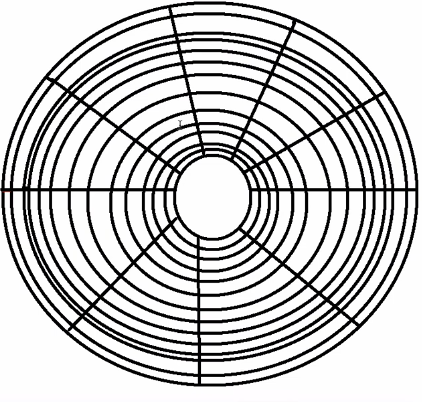
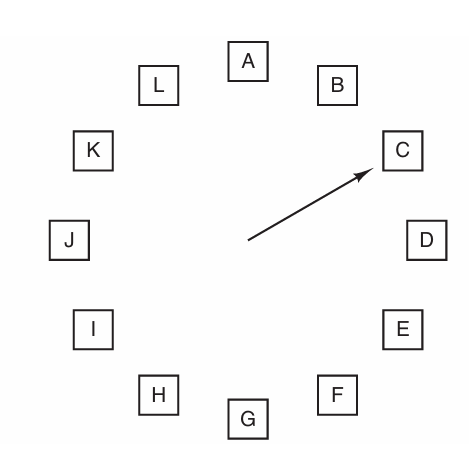

<!--Portada-->
<div align="center">

# Sistemas Operativos

### Actividad<br>Administración de memoria

### ISC

### Docente: Jesus Eduardo Alacaraz Chavez

### Alumno: Efren Mendez Villanueva

</div>

___
<!--3.1 Política y filosofía-->
<div align="center">

# **3.Administraciòn de Memoria** 
</div>

# 3.1 Politica y Filsoifa

## Fragmentación Interna vs Externa

### Fragmentación interna:  
Como su palabra lo indica **interna** nos da a entender que la particiones ocurren en la memoria, ahora estas particiones estan divididas en bloques con tamaños especificos 

por ejemplo:

podemos observar una Fragmentación interna la cual esta divida en partes iguales donde cada parte sera encargada de manejar los procesos


Al memento de asignarle estos procesos estos eran acomodados en los bloques que tenemos


Como se puede observar estos al ser colocados generan un desperdicio puesto que no estan aprovechando el 100% de cada uno.

***conclución:***<br>
La fragmentación interna puede llegar a generar desperdicios de memoria si un proceso no usa lo suficiente asignado puesto que este sobrando no se vuelve usar simplemente queda en nada

### Framgentación externa ### 
La gragmentación externa como su contraparte tambien puede llegar desperdicios pero por otra razones, puesto que esta es guardada de forma dispersa entonces tenemos desperdicios en espaciso que no estamos usando

por ejemplos:

aqui podemos obersvar una imagen de un disco HDD



Al llegarse queda algo asi


Podemos observar que los procesos estan gurdados de forma aleatoria lo cual genera espacios entre ellos

visto de otra forma lo tenemos asi


Esto tiene una solición donde se le puede aplicar una desfragmentación lo cual lo dejara asi


Esto ayuda a optimizar las busquedas muchisimo, aunque los SSD no necesariamente ocupan esto pero los HDD si

## Resuen completo
|  Fragmentación Intera  | Fragmentación Externa  
|  ------- |:----:
|  Ocurre dentro de un bloque asignado| Ocurre fuera de bloques asignados
|  Desperdicio dentro de la memoria asignada| Desperdicio por espacios dispersos 
| Relacionada con Ram y memoria virtual| Ocurre en RAM,memoria virutal, HDD o SDD
| No se puede desfragmentar | Se puede desfragmentar|

## Politicas de remplazo 

**Fifo(First In, First Out):** 
Siendo un algoritmo de paginación de baja sobrecarga, para este algoritmo imaginemos que estamos en un supermercado,
al principio no tendremos ningun producto

|Produco|  Tiempo en el supermercado  | 
|:--------: |   --------       |   
| Null     |  Null           |      
|   Null   |  Null              |       
|  Null|  Null           |         
| Null |  Null              |       

pero despues empezaran a llegar productos, estos seran guardados de forma en el que el primero en llegar es el primero en la fila por ejemplo
nos llega pan

|Produco|  Tiempo en el supermercado  | 
|:--------: |   --------       |   
| pan     |  0           |      

luego leche

|Produco|  Tiempo en el supermercado  | 
|:--------: |   --------       |   
| pan     |  1           |      
| leche   |  0              |   

luego frijoles

|Produco|  Tiempo en el supermercado  | 
|:--------: |   --------       |   
| pan     |  2           |      
| leche   |  1              |       
| frojoles |  0           |

al final queso

|Produco|  Tiempo en el supermercado  | 
|:--------: |   --------       |   
| pan     |  3           |      
| leche   |  2              |       
| frojoles |  1                    
| queso |  0              |       

entonces si llega otro producto como podremos observar estamos llenos, por ende debemos desacernos de algun producto
aqui es donde nuestro algoritmo trabaja, este elige al que lleve mas tiempo en la tiende el cual seria el pan, esto puede entenderse como una pila
donde el primero en llegar es el primero en salir

 **Segunda Chance**

Este puede ser tomado como una modificación del Fifo, por que lo que hacemos es agregar una nueva variable al juego llamada **el bit R** este lo que hace
es mostrar si la pagina a echo referenciada en el un intervalo de reloj reciente, si es 0 la pagina es antigua y no se a usado entonces se descarta pero si es 1 significa que si se a usado por ende no se descarta pero se vuelve un 0 y se reinicia como si acabara de llegar

retomando al ejemplo visto anteriormente, si siguieramos trabajando con Fifo puro entonces se descartaria el pan pero ahora tenemos el bit r por ende se comprueba si este es = 1, como es el caso lo que hacemos es reiniciar el proceso

|Produco|  Tiempo en el supermercado  | bit R   |
|:--------: |   --------       |  --------  |   
| pan     |  3           |      1       |
| leche   |  2              |    0      |
| frojoles |  1              |      1   |
| queso |  0              |  1  |

proceso reiniciado

|Produco|  Tiempo en el supermercado  | bit R   |
|:--------: |   --------       |  --------  |   
| leche   |  2              |    0      |
| frojoles |  1              |      1   |
| queso |  0              |  1  |
| pan     |  0           |      0       |

como podemos observar ahora se toma el pan como proceso nuevo entonces seguimos trabajando, ahora nos topamos con la leche donde este tiene un 0 en el bit lo cual provocaria que se descartara y añadiendo el nuevo proceso entrante que en este caso son nueces

|Produco|  Tiempo en el supermercado  | bit R   |
|:--------: |   --------       |  --------  |   
| frojoles |  1              |      1   |
| queso |  0              |  1  |
| pan     |  1           |      0       |
| nueces   |  0              |    0      |

Si de pura casualidad ya se a echo referencia a todas las paginas y nos topamos un caso como estos

|Produco|  Tiempo en el supermercado  | bit R   |
|:--------: |   --------       |  --------  |   
| frojoles |  1              |      1   |
| queso |  0              |  1  |
| pan     |  1           |      1       |
| nueces   |  0              |    1      |

lo que hara el algoritmo es trabajar como un Fifo puro eliminando simplemente el que tenga mas tiempo 

**Reloj**

Como su nombre lo indica y se podra observar en la imagen hace una simulación a como si fuera un reloj donde la mancilla estara constantemente apuntando
a la pagina mas antigua, cuando ocurra un fallo de pagina la manecilla inspecciona este proceso donde dependiendo si el bit es o u 1 actuara

|Bit R |  Acción  | 
|:--------: |   -------- |   
| R = 0     |  Desaloja la página           |      
| R = 1     |  Desactiva R y avanza la manecilla              |     



**LRU (Least Recently Used):**

**Optimal(OPT)**


**NFU(Not frequently Used)**

**Random**


# 3.2 Memoria real

## Programa en C de particiones fijas
```C
#include <stdio.h>
#include <stdlib.h> //Para manejar la memoria

#define cantidadParticiones 5 //Numero de particiones maximas

//Estructura
typedef struct{
    int tamaño;    //Para el tamaño de nuestros procesos
    int ocupado;   // 0 no estara ocupado 1 estara ocupado
    int id;        // Para el id del proceso
}Particion;

// inicializar las particiones
void inicializar(Particion particiones[]) {
    for (int i = 0; i < cantidadParticiones; i++) {
        printf("Ingrese el tamaño de la partición %d: ", i + 1);
        scanf("%d", &particiones[i].tamaño);
        particiones[i].ocupado = 0;
        particiones[i].id = -1;
    }
}

// Asignar procesos
void asignar(Particion particiones[]) {
    int id, tamaño;
    printf("\nIngrese el ID del proceso: ");
    scanf("%d", &id);
    printf("Ingrese el tamaño del proceso: ");
    scanf("%d", &tamaño);

    int asignado = 0;
    for (int i = 0; i < cantidadParticiones; i++) {
        if (particiones[i].ocupado == 0 && particiones[i].tamaño >= tamaño) {
            particiones[i].ocupado = 1;
            particiones[i].id = id;
            printf("Proceso %d asignado a la partición %d\n",  id, i + 1);
            asignado = 1;
            break;
        }
    }

    if (!asignado) {
        printf("No se pudo asignar el proceso %d debido a falta de espacio.\n", id);
    }
}

// Función para liberar una partición
void liberar(Particion particiones[]) {
    int id;
    printf("\nIngrese el ID del proceso a liberar: ");
    scanf("%d", &id);

    int liberado = 0;
    for (int i = 0; i < cantidadParticiones; i++) {
        if (particiones[i].ocupado == 1 && particiones[i].id == id) {
            particiones[i].ocupado = 0;
            particiones[i].id = -1;
            printf("Partición %d liberada.\n", i + 1);
            liberado = 1;
            break;
        }
    }

    if (!liberado) {
        printf("No se encontró el proceso %d para liberar.\n", id);
    }
}

// Mostrar el estado actual de las particiones
void mostrar(Particion particiones[]) {
    printf("\nEstado actual de las particiones:\n");
    for (int i = 0; i < cantidadParticiones; i++) {
        printf("Partición %d: Tamaño %d, ", i + 1, particiones[i].tamaño);
        if (particiones[i].ocupado == 1) {
            printf("Ocupado por el proceso %d\n", particiones[i].id);
        } else {
            printf("Libre\n");
        }
    }
}

int main(){
    Particion particiones[cantidadParticiones];
    int opc;

    // Inicializamos las particiones
    inicializar(particiones);

    do{
        printf("\n---Menu---\n"
        "1.-Asignar proceso a una partición\n"
        "2.-liberar particion\n"
        "3.-Mostrar particiones\n"
        "4.-Salir \n");
        scanf("%d",&opc);

        switch(opc){
            case 1:
                asignar(particiones);
                break;
            case 2:
                liberar(particiones);
                break;
            case 3:
                mostrar(particiones);
                break;
            case 4:
                printf("Saliendo..");
                break;
            default:
                printf("Opcion invalida, degite una opcion valida por favor");
        }
    } while (opc != 4);
    return 0;
}
```

## Algoritmo para calcular procesos utilizando el algoritmo de "primera cabida"

1. Inicio
2. Leer el tamaño de cada partición
3. Leer el tamaño del proceso asignar
4. Comparar tamaños con los bloques y encontrar el cual puede asignarle el proceso
5. Si se encuentra verificar si esta ocupado
6. Si no esta ocupado usarlo y marcarlo como ocupad
6. Si esta ocupado buscar otro
7. Si se encuentra otro utilizar ese y marcarlo como cupado

    Si no hay otro que pueda cubrir el espacio imprimir "no se cuenta con suficiente espacio"
8. Fin

# 3.3 Organización de memoria virtual

### Paginación y segmentación

**Segmentación** Es la divición de la memoria primeria de un ordenador, esto ayuda para proteger modulos de segmentos contra accesos no autorizados 

**Paginación de memoria** Esta es la divición en pequeñas partes o páginas a un programa 

aqui mismo contamos con los **marcos** estos se les denomina como numero de pagina fisica esta pagina fisica es asignada a un proceso de forma exclusiva

### Programa que simule una tabla de páginas para procesos con acceso aleatorio a memoria virtual

```C
#include <stdio.h>
#include <stdlib.h>

Realmente no se que pedo :)

```
# 3.4 Administración de memoria virtual

### Codigo con el algoritmo "Least Recently Used" (LRU)

### Diagrama para el proceso de traducción de direciones virtuales a fisicas en un sistema con memoria virtual

## Integración

### Analizar un sistema operativo moderno (por ejemplo Linux o Windows) e indentificar como administra la memoria virtual

### Simulacion del swapping de procesos en memoria virtual

<div align="center">

# **4.Administración de Entrada/Salida**
</div>

# 4.1 Dispositivos y menejadores de dispositivos

### Diferencia entre dispositivos de bloque y dispositivos de caracter

### Programa manejador de dispositivos para un dispositivo virtual de entrada

# 4.2 Mecanismos y funciones de los manejadores de dispositivos 

### Interrupciones por E/S y su administración con el S.O

### Programa de interrupciones 

# 4.3 Estructuras de datos para manejo de dispositivos

### Que es una cola de E/S y una simulación de una cola con prioridad

### Programa para manejar las operaciones de dispositivos utilizando una tabla de estructuras

# 4.4 Operaciones de Entrada y Salda

### Diseña un flujo que describa el proceso de lectura de un archivo desde un disco magnético. Acampañado con un programa basico para simular el proceso

### Programa que realice operaciones de entrada/salida asincronas usando archivos