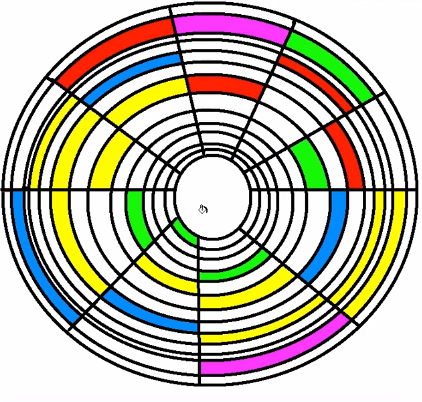
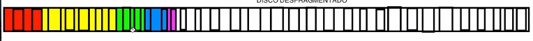

<!--Portada-->
<div align="center">

# Sistemas Operativos

### Actividad<br>Administración de memoria

### ISC

### Docente: Jesus Eduardo Alacaraz Chavez

### Alumno: Efren Mendez Villanueva

</div>

___
<!--3.1 Política y filosofía-->
<div align="center">

# **3.Administraciòn de Memoria** 
</div>

# 3.1 Politica y Filsoifa

## 1.-Fragmentación Interna vs Externa

### Fragmentación interna:  
Como su palabra lo indica **interna** nos da a entender que la particiones ocurren en la memoria, ahora estas particiones estan divididas en bloques con tamaños especificos 

por ejemplo:

podemos observar una Fragmentación interna la cual esta divida en partes iguales donde cada parte sera encargada de manejar los procesos


Al memento de asignarle estos procesos estos eran acomodados en los bloques que tenemos


Como se puede observar estos al ser colocados generan un desperdicio puesto que no estan aprovechando el 100% de cada uno.

***conclución:***<br>
La fragmentación interna puede llegar a generar desperdicios de memoria si un proceso no usa lo suficiente asignado puesto que este sobrando no se vuelve usar simplemente queda en nada

### Framgentación externa ### 
La gragmentación externa como su contraparte tambien puede llegar desperdicios pero por otra razones, puesto que esta es guardada de forma dispersa entonces tenemos desperdicios en espaciso que no estamos usando

por ejemplos:

aqui podemos obersvar una imagen de un disco HDD


Al llegarse queda algo asi



Podemos observar que los procesos estan gurdados de forma aleatoria lo cual genera espacios entre ellos

visto de otra forma lo tenemos asi


Esto tiene una solición donde se le puede aplicar una desfragmentación lo cual lo dejara asi



Esto ayuda a optimizar las busquedas muchisimo, aunque los SSD no necesariamente ocupan esto pero los HDD si

## Resuen completo
|  Fragmentación Intera  | Fragmentación Externa  
|  ------- |:----:
|  Ocurre dentro de un bloque asignado| Ocurre fuera de bloques asignados
|  Desperdicio dentro de la memoria asignada| Desperdicio por espacios dispersos 
| Relacionada con Ram y memoria virtual| Ocurre en RAM,memoria virutal, HDD o SDD
| No se puede desfragmentar | Se puede desfragmentar|

## 2.-Politicas de remplazo 

### Fifo(First In, First Out): 

Siendo un algoritmo de paginación de baja sobrecarga, para este algoritmo imaginemos que estamos en un supermercado,
al principio no tendremos ningun producto

|Produco|  Tiempo en el supermercado  | 
|:--------: |   --------       |   
| Null     |  Null           |      
|   Null   |  Null              |       
|  Null|  Null           |         
| Null |  Null              |       

pero despues empezaran a llegar productos, estos seran guardados de forma en el que el primero en llegar es el primero en la fila por ejemplo
nos llega pan

|Produco|  Tiempo en el supermercado  | 
|:--------: |   --------       |   
| pan     |  0           |      

luego leche

|Produco|  Tiempo en el supermercado  | 
|:--------: |   --------       |   
| pan     |  1           |      
| leche   |  0              |   

luego frijoles

|Produco|  Tiempo en el supermercado  | 
|:--------: |   --------       |   
| pan     |  2           |      
| leche   |  1              |       
| frojoles |  0           |

al final queso

|Produco|  Tiempo en el supermercado  | 
|:--------: |   --------       |   
| pan     |  3           |      
| leche   |  2              |       
| frojoles |  1                    
| queso |  0              |       

entonces si llega otro producto como podremos observar estamos llenos, por ende debemos desacernos de algun producto
aqui es donde nuestro algoritmo trabaja, este elige al que lleve mas tiempo en la tiende el cual seria el pan, esto puede entenderse como una pila
donde el primero en llegar es el primero en salir

### Segunda Chance:

Este puede ser tomado como una modificación del Fifo, por que lo que hacemos es agregar una nueva variable al juego llamada **el bit R** este lo que hace
es mostrar si la pagina a echo referenciada en el un intervalo de reloj reciente, si es 0 la pagina es antigua y no se a usado entonces se descarta pero si es 1 significa que si se a usado por ende no se descarta pero se vuelve un 0 y se reinicia como si acabara de llegar

retomando al ejemplo visto anteriormente, si siguieramos trabajando con Fifo puro entonces se descartaria el pan pero ahora tenemos el bit r por ende se comprueba si este es = 1, como es el caso lo que hacemos es reiniciar el proceso

|Produco|  Tiempo en el supermercado  | bit R   |
|:--------: |   --------       |  --------  |   
| pan     |  3           |      1       |
| leche   |  2              |    0      |
| frojoles |  1              |      1   |
| queso |  0              |  1  |

proceso reiniciado

|Produco|  Tiempo en el supermercado  | bit R   |
|:--------: |   --------       |  --------  |   
| leche   |  2              |    0      |
| frojoles |  1              |      1   |
| queso |  0              |  1  |
| pan     |  0           |      0       |

como podemos observar ahora se toma el pan como proceso nuevo entonces seguimos trabajando, ahora nos topamos con la leche donde este tiene un 0 en el bit lo cual provocaria que se descartara y añadiendo el nuevo proceso entrante que en este caso son nueces

|Produco|  Tiempo en el supermercado  | bit R   |
|:--------: |   --------       |  --------  |   
| frojoles |  1              |      1   |
| queso |  0              |  1  |
| pan     |  1           |      0       |
| nueces   |  0              |    0      |

Si de pura casualidad ya se a echo referencia a todas las paginas y nos topamos un caso como estos

|Produco|  Tiempo en el supermercado  | bit R   |
|:--------: |   --------       |  --------  |   
| frojoles |  1              |      1   |
| queso |  0              |  1  |
| pan     |  1           |      1       |
| nueces   |  0              |    1      |

lo que hara el algoritmo es trabajar como un Fifo puro eliminando simplemente el que tenga mas tiempo 

### Reloj:

Como su nombre lo indica y se podra observar en la imagen hace una simulación a como si fuera un reloj donde la mancilla estara constantemente apuntando
a la pagina mas antigua, cuando ocurra un fallo de pagina la manecilla inspecciona este proceso donde dependiendo si el bit es o u 1 actuara

|Bit R |  Acción  | 
|:--------: |   -------- |   
| R = 0     |  Desaloja la página           |      
| R = 1     |  Desactiva R y avanza la manecilla              |     


### Menos usadas recientemente (LRU): 

En general este algoritmo descarta la pagina que no se a utilizado por mucho tiempo ya que lleva el lema de "si no se a utilizado muy problablemente no se utilizara" 

Aunque este algoritmo no es barato ya que para implementar el LRU por completo es necesario mantener una lista enlazada de todas las paginas en memoria con la pagina de uso más reciente en la parte frontal y la de uso menos reciente en la parte final. La dificultad recae con deber actualizarse en cada referencia de memoria, ya que buscar una pagina en la lista, eliminarla y despues pasarla al frente es una operación que consume mucho tiempo.

*Formas de implementar el LRU:*

1. Contador de 64 bits
      * Este como bien dice funciona con un contador de 64 bits llado C, este se incrementa de manera automatica despues de cada instrucción. Ademas cada entrada en la tabla de páginas debe tener también un campo lo bastante grande como para poder guardar el contador. Despues de cada referencia de memoraia, el valor acutal de C se almacena en la entrada en la tabla de páginas para la pagina que se acaba de referenciar. Cuando ocurre un fallo de pagina, el sistema operativo examina todos los contadores en la tabla de páginas para encontrar el menor, este seria la menos usada

        Para lo siguiente volveremos al ejemplo de la tienda, digamos que tenemos los siguientes productos en el dia 0
      

        |Paginas|  C  |  
        |:--------:|   --------      |   
        | frojoles |  0              |
        | queso    |  0              |  
        | pan      |  0              |   
        | nueces   |  0              |   

        
        Al momento que un producto sea vendido el contador C incrementara uno
        |Paginas|  C  |  
        |:--------:|   --------      |   
        | frojoles |  1              |
        | queso    |  0              |  
        | pan      |  1              |   
        | nueces   |  1              |
        
        Al llegar el dia del corte (Un fallo de pagina en nuestro caso) lo que hara el algoritmo es comparar contadores (c) en busca del menor y descartandolo
        
        |Paginas|  C  |  
        |:--------:|   --------      |   
        | frojoles |  10              |
        | ~~queso~~    |  ~~7~~             |  
        | pan      |  9              |   
        | nueces   |  12              |
2. Manejo mediante Hardware
      * Para una máquina con n marcos de oágina, el hardware del LRU puede mantener una matriz de n x n bits (Inicialmente todos estaran en 0), cada ves que se hace referencia a la pagina k, el hardware primero establece todos los bits de la fila k en 1 y despues todos los bits de la columna k en 0. En cualquier instante, la fila cuyo valor binario sea menor es la de uso menos reciente, la fila cuyo valor sea el siguiente más bajo es la del siguiente uso menos reciente y asi en lo sucesivo.

      por si no recordamos que es una fila y columna son estos:

      **Fila:** esta se pondra en 1 con cada consulta<br>
      //////////

      **Columna:** esta se pondra en 0 con cada consulta<br>
        //<br>
        //<br>
        //<br>
        //<br>
     
     **Ejemplo**
     Entonces nuestro orden de referencia sera este<br>
     0 1 2 3 2 1 0 3 2 3

     Como podemos observar cuando es 0 toda la columna se vuelven 0 y la Fila de 0 se vuelve 1<br>
     asi sucesivamente cuando es cualquier numero de los siguientes (cabe recalcar que no mas tenemos 1 matriz, b,c,d,e son la misma matriz pero con los cambias sufridos por las consultas)

      


### WsClock 

Este algoritmo es un reloj pero con esteroides practicamente, pero sienod de trabajo incomodo ya que exige explorar toda la tabla de páginas en cada fallo de página hasta localizar un candidato adecuado. Este es muy utilizado puesto que es simple de implementar y genera buen rendimiento.

Este al principio tendra las paginas justo como el del reloj, a medida que se agregan más páginas, pasan a la lista para formar un anillo. Cada entrada contiene el campo *Tiempo de último uso* del algotimo básico del conjunto de trabajo, asi como el bit R y un bit M.

Al igual que el algoritmo de reloj, en cada fallo de página se examina primero la página a la que apunta la manecilla. Si el bit R es 1, la página se ha utilizado durante el pulso acutal lo cual evita que elimine pone el R en 0 y se remite el algoritmo. 

Pero si la edad es mayor que t y la página está limpia, significa que no se encuentra en el conjunto de trabajo y existe una copia válida en el disco, probocando que se reclame el marco y la nueva pagina sea colocada ahi.

Si la manecilla llega a otra vez a su punto inicial y se ha planificado por lo menos una escritura la manecilla sólo sigue moviéndose, buscando una pagina limpia


## Pequeño resumen de los algoritmos 

|Algoritmo|  Comentario | 
|-------- |   --------       |     
| óptmio |  No se puede implmentar, pero es útil como punto de comparación              |    
| NRU(No usadas recientemente) |  Una aproximación muy burda del LRU              |  
| FIFO(primero en entrar, primero en salir)     |  Podría descartar páginas importantes           |   
| Segunda oportunidad   |  Gran mejora sobre FIFO              |   
| Reloj   |  Realista              |
| LRU(menos usadas recientemente)   |  Exelente, pero dificil de implementar con exactitud              |
| NFU(no utilizadas frecuentemente)   |  Aproximación a LRU bastante burda              |
| Envejecimiento   |  Algoritmo eficiente que se aproxima bien a LRU              |
| Conjunto de trabajo   |  Muy costoso de implementar              |
| WsClockl   |  Algoritmo eficientemente bueno              |


# 3.2 Memoria real

## 1.-Programa en C de particiones fijas
```C
#include <stdio.h>
#include <stdlib.h> //Para manejar la memoria

#define cantidadParticiones 5 //Numero de particiones maximas

//Estructura
typedef struct{
    int tamaño;    //Para el tamaño de nuestros procesos
    int ocupado;   // 0 no estara ocupado 1 estara ocupado
    int id;        // Para el id del proceso
}Particion;

// inicializar las particiones
void inicializar(Particion particiones[]) {
    for (int i = 0; i < cantidadParticiones; i++) {
        printf("Ingrese el tamaño de la partición %d: ", i + 1);
        scanf("%d", &particiones[i].tamaño);
        particiones[i].ocupado = 0;
        particiones[i].id = -1;
    }
}

// Asignar procesos
void asignar(Particion particiones[]) {
    int id, tamaño;
    printf("\nIngrese el ID del proceso: ");
    scanf("%d", &id);
    printf("Ingrese el tamaño del proceso: ");
    scanf("%d", &tamaño);

    int asignado = 0;
    for (int i = 0; i < cantidadParticiones; i++) {
        if (particiones[i].ocupado == 0 && particiones[i].tamaño >= tamaño) {
            particiones[i].ocupado = 1;
            particiones[i].id = id;
            printf("Proceso %d asignado a la partición %d\n",  id, i + 1);
            asignado = 1;
            break;
        }
    }

    if (!asignado) {
        printf("No se pudo asignar el proceso %d debido a falta de espacio.\n", id);
    }
}

// Función para liberar una partición
void liberar(Particion particiones[]) {
    int id;
    printf("\nIngrese el ID del proceso a liberar: ");
    scanf("%d", &id);

    int liberado = 0;
    for (int i = 0; i < cantidadParticiones; i++) {
        if (particiones[i].ocupado == 1 && particiones[i].id == id) {
            particiones[i].ocupado = 0;
            particiones[i].id = -1;
            printf("Partición %d liberada.\n", i + 1);
            liberado = 1;
            break;
        }
    }

    if (!liberado) {
        printf("No se encontró el proceso %d para liberar.\n", id);
    }
}

// Mostrar el estado actual de las particiones
void mostrar(Particion particiones[]) {
    printf("\nEstado actual de las particiones:\n");
    for (int i = 0; i < cantidadParticiones; i++) {
        printf("Partición %d: Tamaño %d, ", i + 1, particiones[i].tamaño);
        if (particiones[i].ocupado == 1) {
            printf("Ocupado por el proceso %d\n", particiones[i].id);
        } else {
            printf("Libre\n");
        }
    }
}

int main(){
    Particion particiones[cantidadParticiones];
    int opc;

    // Inicializamos las particiones
    inicializar(particiones);

    do{
        printf("\n---Menu---\n"
        "1.-Asignar proceso a una partición\n"
        "2.-liberar particion\n"
        "3.-Mostrar particiones\n"
        "4.-Salir \n");
        scanf("%d",&opc);

        switch(opc){
            case 1:
                asignar(particiones);
                break;
            case 2:
                liberar(particiones);
                break;
            case 3:
                mostrar(particiones);
                break;
            case 4:
                printf("Saliendo..");
                break;
            default:
                printf("Opcion invalida, degite una opcion valida por favor");
        }
    } while (opc != 4);
    return 0;
}
```

## 2.-Algoritmo para calcular procesos utilizando el algoritmo de "primera cabida"

1. Inicio
2. Leer el tamaño de cada partición
3. Leer el tamaño del proceso asignar
4. Comparar tamaños con los bloques y encontrar el cual puede asignarle el proceso
5. Si se encuentra verificar si esta ocupado
6. Si no esta ocupado usarlo y marcarlo como ocupad
6. Si esta ocupado buscar otro
7. Si se encuentra otro utilizar ese y marcarlo como cupado

    Si no hay otro que pueda cubrir el espacio imprimir "no se cuenta con suficiente espacio"
8. Fin

# 3.3 Organización de memoria virtual

##  1.-Paginación y segmentación

### Segmentación  
 Cada segmento consiste en una secuencia lineal de direcciones, desde 0 hasta cierto valor máximo. La longitud de cada segmento
 puede ser cualquier valor desde 0 hasta el máximo permitido. Los distintos segmentos pueden tener distintas longitudes (y por lo general así es). 
 Además las longitudes de los segmentos pueden cambiar durante la ejecución. La longitud de un segmento de pila puede incrementarse 
 cada vez que se meta algo a la pila y decrementarse cada vez que se saque algo.

 Devido a que cada segmento constituy eun espacio de direcciones separado, los distintos segmentos pueden crecer o reducirse de manera independiente, sin afectar unos a otros

 

* Ventajas
    * La vinculación de procedimientos que se compilan por separado se simplifica de manera considerable
    * Si se llega a modificar un segmento no hay neceisdad de cambiar los demas procedimientos (esto por que no se modificaron direcciones iniciales)
    * Facilita la compartición de procedimientos o datos entre varios procesos
    
### Paginación de memoria  
Esta es la divición en pequeñas partes o páginas a un programa 

aqui mismo contamos con los **marcos** estos se les denomina como numero de pagina fisica esta pagina fisica es asignada a un proceso de forma exclusiva

## 2.-Programa que simule una tabla de páginas para procesos con acceso aleatorio a memoria virtual

```C
#include <stdio.h>
#include <stdlib.h>

Realmente no se que pedo :)

```
# 3.4 Administración de memoria virtual

## 1.- Codigo con el algoritmo "Least Recently Used" (LRU)
```C
#include <stdio.h>

//Agregar el elemento al final de la cola
void metodoA(){
    printf("Selecciono metodoA");
}

//Elimina el elemento del frente de la cola (debe ser el primero que llego)
void metodoB(){
    printf("Selecciono metodoB");
}

//Muestra cuantos elementos hay y muestra quien esta primero
void metodoC(){
    printf("Selecciono metodoC");
}

int main() {
   int opcion;

    do {
        printf("\n--- Menu ---\n");
        printf("1. metodoA\n");
        printf("2. metodoB\n");
        printf("3. metodoC\n");
        printf("4. Salir\n");
        printf("Seleccione una opción: ");
        scanf("%d", &opcion);

        switch (opcion) {
            case 1:
                metodoA();
                 break;
            case 2:
                metodoB();
                 break;
            case 3:
                metodoC();
                 break;
            case 4:
                printf("Saliendo...\n");
                break;
            default:
                printf("Opción inválida, por favor intente de nuevo.\n");
        }
    } while (opcion != 4);
    return 0;
}
```

## 2.-Diagrama para el proceso de traducción de direciones virtuales a fisicas en un sistema con memoria virtual

# Integración

## 1-Analizar un sistema operativo moderno (por ejemplo Linux o Windows) e indentificar como administra la memoria virtual

## 2-Simulacion del swapping de procesos en memoria virtual

<div align="center">

# **4.Administración de Entrada/Salida**
</div>

# 4.1 Dispositivos y menejadores de dispositivos

## 1.-Diferencia entre dispositivos de bloque y dispositivos de caracter

### Disposistivos de bloques:<br>
Estos almacen información en blques de tamaño fijo los cuales cuentan con su propia direccion. Estos pueden leer o escribir bloques de forma independiente.
ejemplos de estos son los discos, CD-ROM etc.

### Dispositivos de caracteres:<br>
La diferencia con los bloques es que estos no son direccionables por ende no se puedee acceder directamente a un determinado carácter. 
ejemplos de este tipo de dispositivo son las impresoraas, terminales, citnas, etc.

## 2.- Programa manejador de dispositivos para un dispositivo virtual de entrada

```C
#include <stdio.h>

//Agregar el elemento al final de la cola
void metodoA(){
    printf("Selecciono metodoA");
}

//Elimina el elemento del frente de la cola (debe ser el primero que llego)
void metodoB(){
    printf("Selecciono metodoB");
}

//Muestra cuantos elementos hay y muestra quien esta primero
void metodoC(){
    printf("Selecciono metodoC");
}

int main() {
   int opcion;

    do {
        printf("\n--- Menu ---\n");
        printf("1. metodoA\n");
        printf("2. metodoB\n");
        printf("3. metodoC\n");
        printf("4. Salir\n");
        printf("Seleccione una opción: ");
        scanf("%d", &opcion);

        switch (opcion) {
            case 1:
                metodoA();
                 break;
            case 2:
                metodoB();
                 break;
            case 3:
                metodoC();
                 break;
            case 4:
                printf("Saliendo...\n");
                break;
            default:
                printf("Opción inválida, por favor intente de nuevo.\n");
        }
    } while (opcion != 4);
    return 0;
}
```

# 4.2 Mecanismos y funciones de los manejadores de dispositivos 

## 1.-Interrupciones por E/S y su administración con el S.O con ejemplo en psudocódigo

### Interrupciones por E/S

Esta tecnica fue creada para evitar tener que esperar continuamenete una E/S lo cual nos ahorra recursos, para ello cuando el procesador da una orden de 
E/S a la controladora puede continuar con otro trabajo, ya que ésta le notificará mediante una interrupción del fin de la operacion de E/S. El procesador
ejecutará la trasnferencia de datos, para esto ocuparemos un gestor de disposititos el cual llamaremos **tabla de estado de los dispositivos**

**tabla de estados de los dispositivos:**<br>
Este contendra la entrada por cada dispositivo y el manejador de interrupciones, encargado de determinar el tipo de interrupción y efectuar las accionas
oportunas

Este llevara los siguientes pasos para manejarlo

1. El proceso de usuario pide realizar una operación de lectura a través del servicio correspondiente
2. El manejador de dispositivo comprueba el registro de estado de la controladora para determinar si el dispositivo esta libre. Si esta ocupado, este 
   indicara que espere a que termine 
3. El manejador almacenara una orden de entrada en el registro de órdenes de la controladora y, de esta forma, inicia el dispositivo
4. El manejador almacena la información de la operación inciada de la tabla de estado de los dispositivos. En la entrada correspondiente se guarda la  
   dirección de retorno de la llamada original del proceso, asi como párametros especiales para la operación de E/S. En este momento, el proceso pasa a 
   estado de bloquado y se llama al planificador a corto plazo para continuar con la ejecución de otro proceso
5. Cuando el dispositivo terminba la operación emite una interrupcion, donde el sistema operativo tomara el control y se lo pasara al manejador de interrupciones
6. El manejador de interrupciones determinara qué dispositivo causó la interrupción y le pasa el control a su manejador
7. El menajador del dispositivo recupera la tabla de estado de los dispositivos la informaciónde la operación de E/S 
8. El manejador del dispositivo copia el contenido de los registros de datos de la controladora en el esapcio del usuario 
9. El manejador de dispositivo devuelve el control al planificador para que desbloque el proceso al usuario 


## 2.- Programa de interrupciones 

```C
#include <stdio.h>

//Agregar el elemento al final de la cola
void metodoA(){
    printf("Selecciono metodoA");
}

//Elimina el elemento del frente de la cola (debe ser el primero que llego)
void metodoB(){
    printf("Selecciono metodoB");
}

//Muestra cuantos elementos hay y muestra quien esta primero
void metodoC(){
    printf("Selecciono metodoC");
}

int main() {
   int opcion;

    do {
        printf("\n--- Menu ---\n");
        printf("1. metodoA\n");
        printf("2. metodoB\n");
        printf("3. metodoC\n");
        printf("4. Salir\n");
        printf("Seleccione una opción: ");
        scanf("%d", &opcion);

        switch (opcion) {
            case 1:
                metodoA();
                 break;
            case 2:
                metodoB();
                 break;
            case 3:
                metodoC();
                 break;
            case 4:
                printf("Saliendo...\n");
                break;
            default:
                printf("Opción inválida, por favor intente de nuevo.\n");
        }
    } while (opcion != 4);
    return 0;
}
```

# 4.3 Estructuras de datos para manejo de dispositivos

## 1.-Que es una cola de E/S y una simulación de una cola con prioridad

Este es una estructura de datos lineal que sigue el principio FIFO (First in, Frist out). Funciona como una fila virtual donde el primer elemento que se añade es el primero en ser eliminado

Su aplicación es esencial para mantener un orden predecible en la ejecución de tareas, ya que las operaciones de encolar(añadir al final) y desencolar 
(eliminar al frente) se realizan de manera disciplinada

**Operaciones basicas**
* Encolar: Agregar un elemento al final de la cola.
* Desencolar: Eliminar el elemento al frente de la cola.
* Frente: Obtener el elemento al frente de la cola sin eliminarlo
* Esta vacia: Verificar si la cola esta vacia
* Tamaño: Optener el numero de elementos en la cola 

La pudieramos resumir en estas
* Agregar elemento: Agrega un elemento al final de la cola.
* Eliminar elemento: Elimina el elemento al frente de la cola.
* Ver elementos: Ver la cantidad de elementos y el elemento de enfrente de la cola

### Simulación
```C
#include <stdio.h>

//Agregar el elemento al final de la cola
void agregar(){
    printf("Selecciono agregar elemento");
}

//Elimina el elemento del frente de la cola (debe ser el primero que llego)
void eliminar(){
    printf("Selecciono eliminar elemento");
}

//Muestra cuantos elementos hay y muestra quien esta primero
void verElementos(){
    printf("Selecciono ver elementos");
}

int main() {
   int opcion;

    do {
        printf("\n--- Menu ---\n");
        printf("1. Agregar elemento\n");
        printf("2. Eliminar elemento\n");
        printf("3. Ver elementos\n");
        printf("4. Salir\n");
        printf("Seleccione una opción: ");
        scanf("%d", &opcion);

        switch (opcion) {
            case 1:
                agregar();
                 break;
            case 2:
                eliminar();
                 break;
            case 3:
                verElementos();
                 break;
            case 4:
                printf("Saliendo...\n");
                break;
            default:
                printf("Opción inválida, por favor intente de nuevo.\n");
        }
    } while (opcion != 4);
    return 0;
}
```

## 2.-Programa para manejar las operaciones de dispositivos utilizando una tabla de estructuras

```C
 #include <stdio.h>

//Agregar el elemento al final de la cola
void metodoA(){
    printf("Selecciono metodoA");
}

//Elimina el elemento del frente de la cola (debe ser el primero que llego)
void metodoB(){
    printf("Selecciono metodoB");
}

//Muestra cuantos elementos hay y muestra quien esta primero
void metodoC(){
    printf("Selecciono metodoC");
}

int main() {
   int opcion;

    do {
        printf("\n--- Menu ---\n");
        printf("1. metodoA\n");
        printf("2. metodoB\n");
        printf("3. metodoC\n");
        printf("4. Salir\n");
        printf("Seleccione una opción: ");
        scanf("%d", &opcion);

        switch (opcion) {
            case 1:
                metodoA();
                 break;
            case 2:
                metodoB();
                 break;
            case 3:
                metodoC();
                 break;
            case 4:
                printf("Saliendo...\n");
                break;
            default:
                printf("Opción inválida, por favor intente de nuevo.\n");
        }
    } while (opcion != 4);
    return 0;
}
```

# 4.4 Operaciones de Entrada y Salda

## 1.-Diseña un flujo que describa el proceso de lectura de un archivo desde un disco magnético. Acampañado con un programa basico para simular el proceso

```C
#include <stdio.h>

//Agregar el elemento al final de la cola
void metodoA(){
    printf("Selecciono metodoA");
}

//Elimina el elemento del frente de la cola (debe ser el primero que llego)
void metodoB(){
    printf("Selecciono metodoB");
}

//Muestra cuantos elementos hay y muestra quien esta primero
void metodoC(){
    printf("Selecciono metodoC");
}

int main() {
   int opcion;

    do {
        printf("\n--- Menu ---\n");
        printf("1. metodoA\n");
        printf("2. metodoB\n");
        printf("3. metodoC\n");
        printf("4. Salir\n");
        printf("Seleccione una opción: ");
        scanf("%d", &opcion);

        switch (opcion) {
            case 1:
                metodoA();
                 break;
            case 2:
                metodoB();
                 break;
            case 3:
                metodoC();
                 break;
            case 4:
                printf("Saliendo...\n");
                break;
            default:
                printf("Opción inválida, por favor intente de nuevo.\n");
        }
    } while (opcion != 4);
    return 0;
}
```

## 2.- Programa que realice operaciones de entrada/salida asincronas usando archivos

```C
#include <stdio.h>

//Agregar el elemento al final de la cola
void metodoA(){
    printf("Selecciono metodoA");
}

//Elimina el elemento del frente de la cola (debe ser el primero que llego)
void metodoB(){
    printf("Selecciono metodoB");
}

//Muestra cuantos elementos hay y muestra quien esta primero
void metodoC(){
    printf("Selecciono metodoC");
}

int main() {
   int opcion;

    do {
        printf("\n--- Menu ---\n");
        printf("1. metodoA\n");
        printf("2. metodoB\n");
        printf("3. metodoC\n");
        printf("4. Salir\n");
        printf("Seleccione una opción: ");
        scanf("%d", &opcion);

        switch (opcion) {
            case 1:
                metodoA();
                 break;
            case 2:
                metodoB();
                 break;
            case 3:
                metodoC();
                 break;
            case 4:
                printf("Saliendo...\n");
                break;
            default:
                printf("Opción inválida, por favor intente de nuevo.\n");
        }
    } while (opcion != 4);
    return 0;
}
```
<div align="center">

# **Integración**

</div>

## 1.-Escribe un programa que implemente el algoritmo de planificación de discos "Elevator (SCAN)"

```C
#include <stdio.h>

//Agregar el elemento al final de la cola
void metodoA(){
    printf("Selecciono metodoA");
}

//Elimina el elemento del frente de la cola (debe ser el primero que llego)
void metodoB(){
    printf("Selecciono metodoB");
}

//Muestra cuantos elementos hay y muestra quien esta primero
void metodoC(){
    printf("Selecciono metodoC");
}

int main() {
   int opcion;

    do {
        printf("\n--- Menu ---\n");
        printf("1. metodoA\n");
        printf("2. metodoB\n");
        printf("3. metodoC\n");
        printf("4. Salir\n");
        printf("Seleccione una opción: ");
        scanf("%d", &opcion);

        switch (opcion) {
            case 1:
                metodoA();
                 break;
            case 2:
                metodoB();
                 break;
            case 3:
                metodoC();
                 break;
            case 4:
                printf("Saliendo...\n");
                break;
            default:
                printf("Opción inválida, por favor intente de nuevo.\n");
        }
    } while (opcion != 4);
    return 0;
}
```

## 2.-Diseña un sisetema que maneje múltiples dispositivos simulados(disco duro, impresora, teclado) y muestre cómo se realiza la comunicación entre llos

```C
#include <stdio.h>

//Agregar el elemento al final de la cola
void metodoA(){
    printf("Selecciono metodoA");
}

//Elimina el elemento del frente de la cola (debe ser el primero que llego)
void metodoB(){
    printf("Selecciono metodoB");
}

//Muestra cuantos elementos hay y muestra quien esta primero
void metodoC(){
    printf("Selecciono metodoC");
}

int main() {
   int opcion;

    do {
        printf("\n--- Menu ---\n");
        printf("1. metodoA\n");
        printf("2. metodoB\n");
        printf("3. metodoC\n");
        printf("4. Salir\n");
        printf("Seleccione una opción: ");
        scanf("%d", &opcion);

        switch (opcion) {
            case 1:
                metodoA();
                 break;
            case 2:
                metodoB();
                 break;
            case 3:
                metodoC();
                 break;
            case 4:
                printf("Saliendo...\n");
                break;
            default:
                printf("Opción inválida, por favor intente de nuevo.\n");
        }
    } while (opcion != 4);
    return 0;
}
```
<div align="center">

# **Avanzados**

</div>


## 1.-Explica cómo lo sisstemas operativos modernos optimizan las operaciones de entrada/salida con el uso de memoria caché

### E/S de Unix

Unix maneja ficheros, entonces cada E/S esta asociado con un fichero especial que gestiona el sistema de ficheros, se lee y escribe de la misma manera que 
los ficheros de datos de usuario. Esto ayuda a proporcionar una interfaz bien definida y uniforme para los usuarios y los procesos.

En Unix contamos con dos tipos de E/S
1. Con buffer (Este es el que nos interesa y hablaremos)
2. Sin buffer

### 1.- Cache de Buffers<br>
Este es esencialmente un cache de disco. Este maneja las operaciones de E/S sobre el disco a través del cache de buffers. estu utilizando DMA para la 
transferencia de datos entre el cache de buffers y el espacio de procesos de los usuarios. Ya que el cache de buffers como el área de E/S esta en memoria 
principal, utilizamos el sistema DMA para realizar una copia de memoria a memoria, esto no consumira ningun ciclo del procesador, pero consume ciclos del bus

**Listas para gestionar el cache de buffers**
* **Lista de libres:** Lista de todos los heucos de la cache (En UNIX a un hueco se le denomina buffer, cada hueco almacena un sector del dispo) que están disponibles para su asignación
* **Lista de dispositivos:** Lista de todos los buffers que están actualmente asociados con cada disco.
* **Cola de E/S del manejador:** Lista de los buffers sobre los que se está realmente realizando E/S o esperando por la misma para un determinado dispositivo.

En general todo s los buffers deberian estar en la lista de libres o en la cola de E/S del manejador. Una vez que se asocia un buffer a un dispositivo,
este permanece asociado al mismo incluso aunque esté en la lista de libres, hasta que se reutilice realmente y pase a esar vinculado con otro dispositivo.
Estas listas se gestionan usando punterios asociados a cada buffer en vez de utilizar listas fisicamente independientes.


Cuando se hace referencia a un número de bloque físico de un determinado dispositivo, el sistema operativo primero comprueba si el bloque está en la cache
de buffers. Para minimizar el tiempo de búsqueda, la lista de dispositivos se organiza como una tabla hash, utilizando una técnica similar al desbordamiento con encadenamiento.

Aqui tenemos un ejemplo de la orgnaización general de la cache de buffers (En este saco manejado y llamado como **Cola de Caracteres**):


En el ejemplo encontramos una tabla hash de longitud fija que contiene punteros a la cache de buffers. Cada referencia a un (dispositivo#, bloque#) se corresponde con una determinada entrada de la tabla hash. El puntero de dicha entrada apunta al primer buffer de la cadena. Un puntero hash incluido en cada buffer señala al siguiente buffer en la cadena correspondiente a esa entrada de la tabla hash. Por tanto , se cumple que para todas las referencias(dispositivo#, bloque#) que se corresponden con la misma entrada de la tabla hash, si el bloque correspondiente esta en la cache de buffers, ese buffer estará en la cadena vinculada a esa entrada de la tabla hash. por consiguiente la longitud de la búsqueda de la cadena de buffers se reduce por un factor de orden N, siendo N la longitud de la tabla hash. 

Para remplazao del bloque utilizamos el algoritmo del menos reciente usado. Una vez que el buffer s ele ha asignado un bloque de disco, no puede utilizarse para otro bloque hasta que se hayan usado más recientemente los restantes buffers. La lista de libres mantiene el orden requerido por el algoritmos

forma de gestionarse

 |Dispositivos orientados a bloques| Forma de gestionarse|   Dispositivos orientados a caracteres  | Forma de gestionarse | 
 | --------|   --------         | --------| --------| 
 | Disco   |      Cache de buffers         |   terminales      | Cola de caracteres (Otro tipo de buffer)|
 | cinta   |      Cache de buffers           |  impresoras |Cola de caracteres (Otro tipo de buffer)|
 | etc..   |      Cache de buffers            |   etc..    |Cola de caracteres (Otro tipo de buffer)|

### E/S de Windows

### E/S de Linux